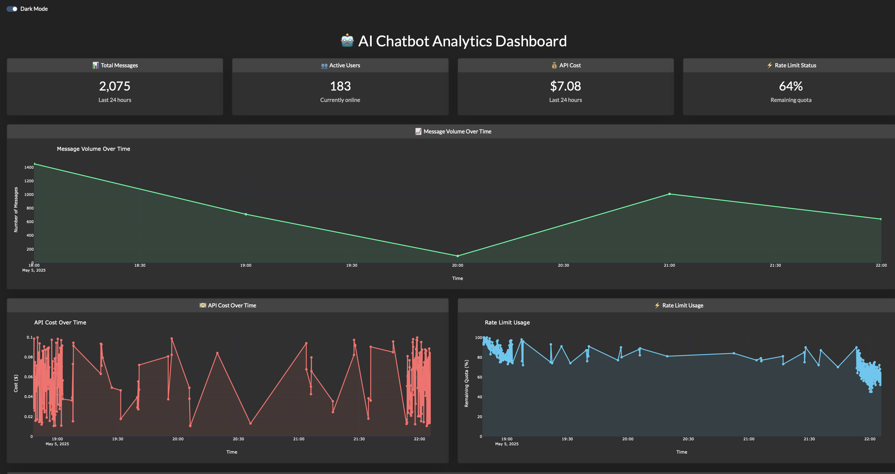

# 🔍 Real-Time Analytics Dashboard for AI Chatbot Monitoring

A responsive, production-ready dashboard that monitors key metrics of an AI chatbot system in real time.


## 🚀 Features

- 🔄 Real-time updates every 5 seconds
- 📊 Message volume, API cost, rate limits, and user activity
- 🌍 Heatmap showing usage patterns by day and hour
- 🌘 Dark mode with responsive Bootstrap UI
- 🧠 Realistic time-based and random data simulation
- 🛠 Scalable architecture with Redis + MongoDB

## 🧱 Tech Stack

- **Backend:** Python, Flask, Dash, Redis, MongoDB
- **Visualization:** Plotly, Dash Core Components
- **UI:** Bootstrap
- **Data Flow:**  
  `collector.py → Redis → Dash callbacks → MongoDB`

## 📸 Screenshots

### Dashboard Overview



## 📂 Project Structure

```bash
collector.py     # Simulates and pushes data
app.py           # Serves the dashboard via Dash
config.py        # Centralized settings
